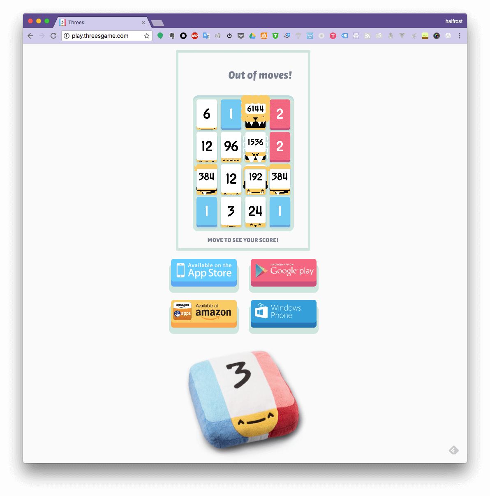
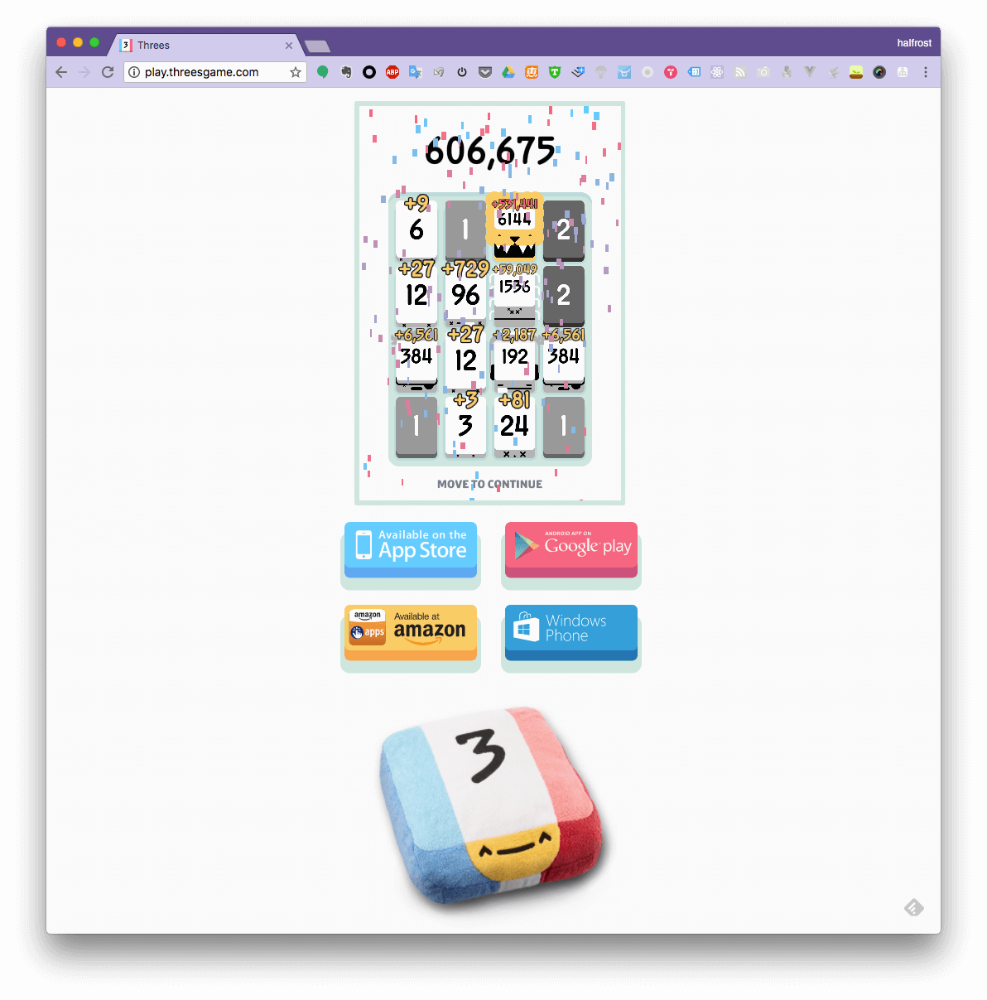
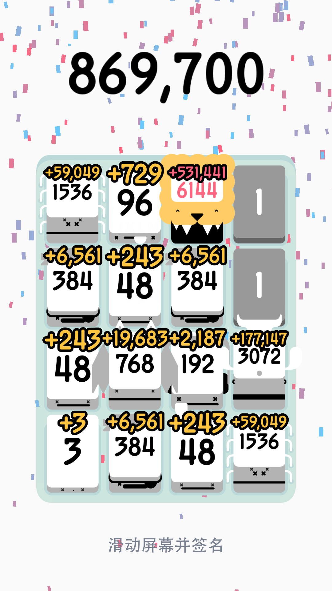
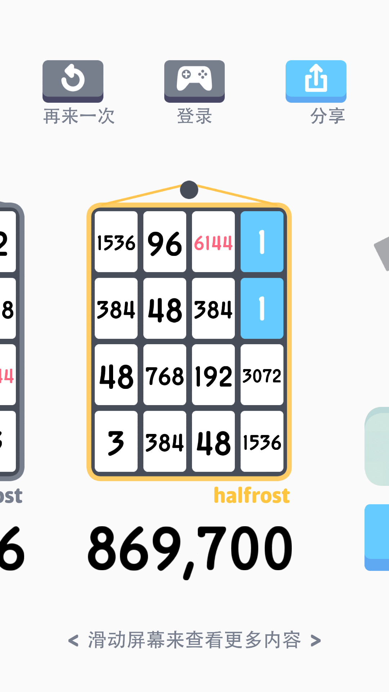
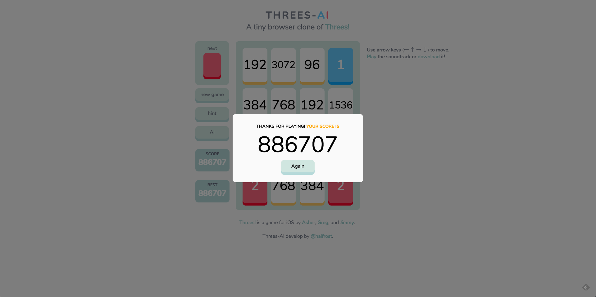
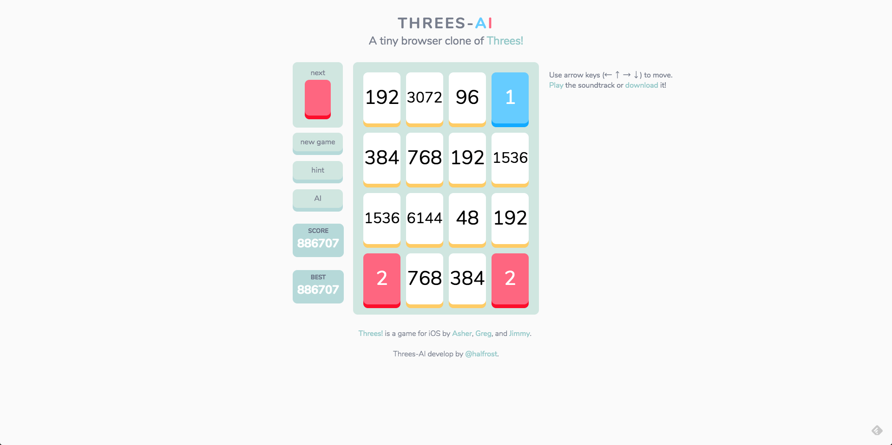
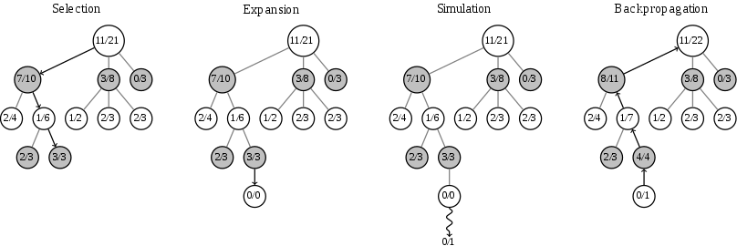

<p align='center'>

</p>

<p align='center'>
🤖 AI for the Threes! game. 🎮
</p>

# 灵感来源

1个月前和另外二位小伙伴一起参加了一个 AI 的比赛。虽然比赛结果不理想，至少我享受到了编程过程中的乐趣。从这次比赛中让我认识到 Go 除了写服务端，写游戏模拟器，写 AI 都是拿手好戏。最近微信跳一跳的辅助，冲顶大会的辅助基本也都是 Go 写的。于是我更坐不住了，也写一个来纪念我们那次比赛。


由于本人也是客户端出身，所以这个 AI 必须也能在手机上刷分。所以要找一个手机游戏，三个人可以玩的，或者名字带“三”字的，由此：


> Threes preson join one AI competition  ---> Threes-AI

# “炫耀”分数

目前这个 Go 版本的 AI 在 3 个地方跑了分，都分别跑了 200 盘。拿到高分的比例差不多就 20% 左右。所以也希望能在项目第二阶段——机器学习阶段，能把跑高分的比率提高到 100% 

## 1. play threes game 官方网站

这个网站就是官方游戏的 web 版了。

<p align='center'>

</p>

<p align='center'>

</p>

<p align='center'>

</p>


<p align='center'>

</p>

## 2. threes Android 客户端

这里之所以没有跑 iOS 客户端的游戏截图，是因为 iOS 客户端需要越狱才能运行，笔者手头上的机器都在 iOS 11.2+，等以后越狱了可以再重新来跑跑分。


<p align='center'>

</p>

<p align='center'>

</p>


## 3. threes game 自建网站

为了能自己通过机器学习训练模型，也为了能公开展示这个 AI 的实力，于是按照官方的游戏规则，原汁原味的复刻了一个 web 版。

<p align='center'>

</p>


<p align='center'>

</p>

在网络上流程着这样一个“谣传”：当合成出 12288 砖块的时候，即 2个 6144 砖块合并，游戏就会结束，开始播放游戏制作人的名单。在这个网站上并没有这个规则，能合成出多高的砖块都可以。分数没有上线，这样也可以充分检验 AI 的智慧。

当然针对官方的前 2 个游戏地址，笔者还真的没有合成出一次 12288 砖块，所以也无法验证“谣传”的真伪。100% 合成出 12288 砖块，也是本 AI 的目标。**暂时还没有达到目标**。


# 运行方法

```go

go build -buildmode=c-shared -o threes.so main.go


```


```go

sudo /Applications/Google\ Chrome.app/Contents/MacOS/Google\ Chrome --remote-debugging-port=9162

python threes_ai_web.py -b chrome -p 9162


```

有时候不加 sudo 命令的话，可能出现一些异常，比如 GPU 分配失败。

```

已在现有的浏览器会话中创建新的窗口。
[29819:45571:0225/225036.004108:ERROR:browser_gpu_channel_host_factory.cc(121)] Failed to launch GPU process.

```

遇到上面的错误，把 Chrome 完全退出，再执行 `--remote-debugging-port=9162` 即可。一般会建立新的 websocket 连接，例如：

```

DevTools listening on ws://127.0.0.1:9162/devtools/browser/86c6deb3-3fc1-4833-98ab-0177ec50f1fa

```

# 游戏分析

Threes 的难点在于，这是一个**必输**的游戏。当游戏到了后半段，合成出了 6144 之后，很大一部分时间这个砖块所在的位置就不能动了，相当于 4 * 4 = 16 个格子，减去一个给它。场地上的砖块到后期也无法一下子合并，所以预留的空间很少，常常因为周转不开或者连续来 1 或者连续来 2，无法合成 3 ，活活被“挤死”了。

网页版设计过程中，并没有向客户端那样考虑“跳级”的模式，即出现的砖块能出现 3 的倍数的，比如出现 3，6，12，24，96，192，384…… 这些大额的砖块。所以网页版的游戏过程可能会比客户端上的简单一点。

为何说会简单一点？因为虽然不会出大的砖块（大砖块分值高），玩的时间会比较长，但是这样存活率也稍微高一点。如果连续的来，96，384，768，都来单个的，这样会导致棋盘上一下子出来很多不能合成的砖块，虽然分数会一下子暴涨，但是也会因为无法被合并，导致无法移动，迅速结束游戏。

在客户端上就存在“跳级”的设定，就可能一段时间就会出现这些砖块。我在测试 AI 的时候也发现了这个问题，被连续来单个的 1 或者连续的来单个的 2 逼死的几率不大，倒是被高分大砖块逼死的情况很多，这样导致存活时间不长，分数也没有网页版的高。


# 算法思想

本 repo 是用 Expectimax Search 实现的，当然这个问题还有其他的解法，这里也稍微提及一下算法思想，对应的是算法二和算法三，但是不用代码实现了。

## 一. Expectimax Search Trees 最大期望搜索树

在日常生活中，有些情况下，我们经过深思熟虑也不能判断这个抉择会导致什么样的结果？是好还是坏？

- 1. 摸扑克牌的时候，永远不知道下一张摸到的会是什么牌，拿到这张未知的牌会对牌局产生什么样的影响？
- 2. 扫雷游戏，每次随时点击一个方格，有可能是雷，也有可能是数字，雷的随机位置会直接影响该回合是否直接游戏结束。
- 3. 吃豆人游戏，幽灵的位置随机出现，直接导致接下来的路线规划。
- 4. Threes！游戏中，1 和 2 的方块随机出现，将会影响我们该怎么移动方块。

以上这些情况都可以用 Expectimax Search Trees 最大期望搜索树去解决这个问题。这类问题都是想求一个最大值（分数）。主要思想如下：

最大值节点和 minimax search 极大极小值搜索一样，作为整棵树的根节点。中间插入“机会”节点 Chance nodes，和最小节点一样，但是要除去结果不确定的节点。最后利用加权平均的方式求出最大期望即最终结果。

**这类问题也可以被归结为 Markov Decision Processes 马尔科夫决策过程，根据当前棋面状态，确定下一步动作。**

### 1. Expectimax 最大期望值的一些特性

其他的节点也并非是敌对的节点，它们也不受我们控制。原因就是因为它们的未知性。我们并不知道这些节点会导致发生什么。

每个状态也同样具有最大期望值。也不能一味的选择最大期望值 expectimax，因为它不是 100% 安全的，它有可能导致我们整个树“松动”。

机会节点是由加权平均值概率管理的，而不是一味的选择最小值。


### 2. 举例

举个例子：

玩家需要以得到最高分数为目标去行动。假设每一步的概率都相同。

```
伪代码


```


### 3. 关于剪枝

**在 expectimax 中不存在剪枝的概念**。

首先，对手是不存在“最佳游戏”的概念，因为对手的行为是随机的，也是未知的。所以不管目前期望值是多少，未来随机出现的情况都可能把当前的情况推翻。也由于这个原因，寻找 expectimax 是缓慢的（不过有加速的策略）。


### 4. 概率函数

在 Expectimax Search 期望最大值搜索中，我们有一个在任何状态下对手行为的概率模型。这个模型可以是简单的均匀分布（例如掷骰子），模型也可能是复杂的，需要经过大量计算才能得到一个概率。


最不确定的因素就是对手的行为或者随机的环境变换。假设针对这些状态，我们都能有一个“神奇的”函数能产生对应的概率。概率会影响到最终的期望值。函数的期望值是其平均值，由输入的概率加权分布。

举个例子：计算去机场的时间。行李的重量会影响到行车时间。

```
L（无）= 20，L（轻）= 30，L（重）= 60

```

三种情况下，概率分布为：

```

P（T）= {none：0.25，light：0.5，heavy：0.25}


```

那么预计驾车时间记为 

```

E [L（T）] =  L（无）* P（无）+ L（轻）* P（轻）+ L（重）* P (重)
E [L（T）] =  20 * 0.25）+（30 * 0.5）+（60 * 0.25）= 35


```


### 5. 数学理论

在概率论和统计学中，数学期望(mean)（或均值，亦简称期望）是试验中每次可能结果的概率乘以其结果的总和，是最基本的数学特征之一。它反映随机变量平均取值的大小。

需要注意的是，期望值并不一定等同于常识中的“期望”——“期望值”也许与每一个结果都不相等。期望值是该变量输出值的平均数。期望值并不一定包含于变量的输出值集合里。

大数定律规定，随着重复次数接近无穷大，数值的算术平均值几乎肯定地收敛于期望值。


https://web.uvic.ca/~maryam/AISpring94/Slides/06_ExpectimaxSearch.pdf


## 二. Minimax search 极小极大值搜索


冯·诺依曼于 1928 年提出的极小化极大理论（minimax）为之后的对抗性树搜索方法铺平了道路，而这些在计算机科学和人工智能刚刚成立的时候就成为了决策理论的根基。

https://github.com/rianhunter/threes-solver

## 三. Monte Carlo tree search 蒙特卡洛树搜索

蒙特卡洛方法通过随机采样解决问题，随后在 20 世纪 40 年代，被作为了一种解决模糊定义问题而不适合直接树搜索的方法。Rémi Coulomb 于 2006 年将这两种方法结合，来提供一种新的方法作为围棋中的移动规划，如今称为蒙特卡洛树搜索（MCTS）。理论上 MCTS 可以应用于任何能够以 {状态，动作} 形式描述，通过模拟来预测结果的领域。


蒙特卡罗 是一种基于平均样本回报来解决增强学习问题的方法。AlphaGo 利用 蒙特卡洛树搜索 快速评估棋面位置价值的。我们同样可以用这种方法来评估 Threes 当前移动的拿到最高分的概率。

围棋棋盘横竖各有 19 条线，共有 361个 落子点，双方交替落子，这意味着围棋总共可能有 10^171(1后面有171个零) 种可能性。这超过了宇宙中的原子总数是 10^80(1后面80个零)！

而传统AI一般采用的是暴力搜索方法（深蓝就是这样干的），就所有可能存在的下法构建一个树。由于状态空间巨大，想通过暴力枚举的方法枚举所有的状态是不可能的。

<p align='center'>

</p>


蒙特卡罗树搜索大概可以被分成四步。选择(Selection)，拓展(Expansion)，模拟(Simulation)，反向传播(Backpropagation)。

在开始阶段，搜索树只有一个节点，也就是我们需要决策的局面。搜索树中的每一个节点包含了三个基本信息：代表的局面，被访问的次数，累计评分。


选择：从根 R 开始，并选择连续的子节点到叶节点L.下面的部分更多地介绍了选择子节点的方法，让游戏树扩展到最有希望的移动，这是蒙特卡罗树搜索的本质。 

扩张：除非L以任何一方的双赢结束游戏，否则创建一个（或多个）子节点并从其中选择一个节点 C. 

模拟：从节点 C 播放随机播放。此步骤有时也称为 playout 或 rollout。 

反向传播：使用 playout 的结果更新从 C 到 R 路径上的节点中的信息.

<p align='center'>

</p>


该图显示了一个决定所涉及的步骤，每个节点显示从该点所代表的玩家的角度来看该玩家获胜/玩的次数。所以，在选择图中，黑色即将移动。 11/21 是从这个位置到目前为止 playouts 的白棋总数。它反映了在它下面的三个黑色节点所显示的总共 10/21 个黑棋胜利，每个黑色胜利表示可能的黑色移动。

当白色模拟失败时，沿着选择的所有节点增加了他们的模拟计数（分母），但是其中只有黑色节点被记入胜利（分子）。如果取而代之的是白方，那么所选的所有节点仍然会增加他们的模拟计数，但是其中只有白方节点会获胜。这就保证了在选择过程中，每个玩家的选择都会扩展到该玩家最有希望的移动反映每个玩家的目标，以最大化他们的行动的价值。

只要分配给移动的时间保持不变，就会重复搜索。然后选择最多的模拟（即最高的分母）作为最终答案。


从这里我们可以看出 蒙特卡洛树搜索 一种启发式的搜索策略，它利用了频率去估算了概率，当样本的频率采集足够多的时候，频率近似于概率。就相当于我们随机抛硬币，只要抛的次数足够多，那么，正面朝上的频率会无限接近于 0.5。

Reference:

[1]:Browne C B, Powley E, Whitehouse D, et al. A Survey of Monte Carlo Tree Search Methods[J]. IEEE Transactions on Computational Intelligence & Ai in Games, 2012, 4:1(1):1-43.

[2]:P. Auer, N. Cesa-Bianchi, and P. Fischer, “Finite-time Analysis  of the Multiarmed Bandit Problem,” Mach. Learn., vol. 47, no. 2,  pp. 235–256, 2002.


# To-Do

本来以为这个项目就这样终结了，结果近几天阿里发布了 “黄皮书” 以后，突然觉得有了新的思路，如果有时间，我会完成第二版的。希望更加智能的 AI 能完成 12288 的最高成就。

